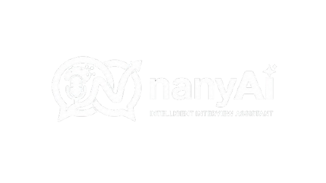

<div align="center">
  
  
  # nanyAi — AI-Powered Interview Platform

  **Practice job interviews with AI, get instant feedback, and experience real voice simulation.**

  [](https://nextjs.org)
  [](https://react.dev)
  [](https://tailwindcss.com)
  [](https://firebase.google.com)
  [](https://deepseek.com)
  [](https://vapi.ai)
</div>

---

## 📋 Table of Contents

- [✨ Features](#-features)
- [🛠 Tech Stack](#-tech-stack)
- [📁 Project Structure](#-project-structure)
- [🚀 Quick Start](#-quick-start)
- [🔧 Environment Variables](#-environment-variables)
- [📸 Screenshots](#-screenshots)

---

## ✨ Features

| Feature | Description |
|---|---|
| 🔐 **Authentication** | Sign up / sign in with Firebase Auth + httpOnly session cookies |
| 🤖 **AI Question Generation** | Auto-generate interview questions using DeepSeek AI, in Bahasa Indonesia |
| 🎤 **Voice Interview** | Real-time voice interview simulation with an AI interviewer (via Vapi.ai) |
| 🎧 **Auto Transcription** | Conversations transcribed in real-time with Deepgram (STT) |
| 🗣 **Natural Voice** | AI speaks naturally via ElevenLabs (TTS) |
| 📊 **AI Feedback** | After the interview, AI analyzes responses & provides scores + improvement suggestions |
| 📱 **Responsive** | Mobile-friendly UI with Tailwind CSS + shadcn/ui |
| 🌙 **Dark Mode** | Dark theme by default with a custom color palette |
| 🔌 **Auto-End Call** | Calls automatically end when the interview is done (silence timeout + closing phrases) |

---

## 🛠 Tech Stack

### Frontend
- **Next.js 15** (App Router + Turbopack)
- **React 19** (Server & Client Components)
- **Tailwind CSS 4** + **shadcn/ui** (New York style)
- **React Hook Form** + **Zod** (form validation)

### Backend / API
- **Next.js API Routes** + **Server Actions**
- **Firebase Admin SDK** (Firestore database)
- **Firebase Auth** (httpOnly session cookie-based)

### AI & Voice
- **DeepSeek** (`deepseek-chat`) — question generation + feedback
- **Vapi.ai** — voice interview orchestrator
- **Deepgram** (Nova-2) — speech-to-text
- **ElevenLabs** — text-to-speech

### Utilities
- **dayjs** — date formatting
- **clsx** + **tailwind-merge** — class merging
- **Lucide React** — icons
- **Sonner** — toast notifications

---

## 📁 Project Structure

```
nanyAi/
├── app/
│   ├── (auth)/                      # Sign-in & sign-up pages
│   ├── (root)/                      # Main protected pages
│   │   ├── page.tsx                 # Homepage — interview lists
│   │   ├── layout.tsx               # Layout with navbar + logout
│   │   ├── loading.tsx              # Loading skeleton
│   │   ├── error.tsx                # Error boundary
│   │   └── interview/
│   │       ├── page.tsx             # Generate questions (form)
│   │       └── [id]/
│   │           ├── page.tsx         # Voice interview page
│   │           └── feedback/        # AI feedback page
│   ├── api/vapi/generate/           # Question generation API (POST)
│   ├── layout.tsx                   # Root layout
│   └── globals.css                  # Global styles + Tailwind
├── components/
│   ├── Agent.tsx                    # Voice interview client
│   ├── AuthForm.tsx                 # Sign-in / sign-up form
│   ├── GenerateForm.tsx             # Interview generation form
│   ├── InterviewCard.tsx            # Interview card
│   ├── DisplayTechIcons.tsx         # Tech stack icons
│   ├── LogoutButton.tsx             # Logout button
│   ├── Spinner.tsx                  # Loading spinner
│   ├── FormField.tsx                # Form input wrapper
│   └── ui/                          # shadcn/ui components
├── lib/
│   ├── actions/
│   │   ├── auth.action.ts           # Server actions: auth
│   │   └── general.action.ts        # Server actions: interview & feedback
│   ├── vapi.sdk.ts                  # Vapi client initialization
│   └── utils.ts                     # cn(), tech icons, cover images
├── firebase/
│   ├── admin.ts                     # Firebase Admin SDK
│   └── client.ts                    # Firebase Web SDK
├── constants/
│   └── index.ts                     # Vapi config, feedback schema, tech mappings
├── types/
│   └── index.d.ts                   # TypeScript type declarations
└── public/                          # Static assets (logo, icons, covers)
```

---

## 🚀 Quick Start

### Prerequisites
- **Node.js** 18+
- **Firebase** account (Firestore + Auth)
- **DeepSeek** account (API key + credits)
- **Vapi** account (web token, for voice interview)

### 1. Clone & Install

```bash
git clone https://github.com/<username>/nanyAi.git
cd nanyAi
npm install
```

### 2. Environment Variables

Create a `.env` file in the root directory:

```env
# Firebase Admin SDK
FIREBASE_PROJECT_ID=...
FIREBASE_CLIENT_EMAIL=...
FIREBASE_PRIVATE_KEY=...

# Firebase Web SDK
NEXT_PUBLIC_FIREBASE_API_KEY=...
NEXT_PUBLIC_FIREBASE_AUTH_DOMAIN=...
NEXT_PUBLIC_FIREBASE_PROJECT_ID=...
NEXT_PUBLIC_FIREBASE_STORAGE_BUCKET=...
NEXT_PUBLIC_FIREBASE_MESSAGING_SENDER_ID=...
NEXT_PUBLIC_FIREBASE_APP_ID=...

# DeepSeek AI
DEEPSEEK_API_KEY=sk-...

# Vapi Voice AI
NEXT_PUBLIC_VAPI_WEB_TOKEN=...
```

### 3. Firebase Setup

1. Go to [Firebase Console](https://console.firebase.google.com)
2. Create a project → **Firestore Database** (Native mode)
3. **Authentication** → enable Email/Password
4. **Project Settings** → Service Accounts → Generate private key → copy to `.env`

### 4. Vapi Assistant Setup

1. Go to [Vapi Dashboard](https://dashboard.vapi.ai)
2. Create an Assistant with:
   - Transcriber: Deepgram `nova-2` (Bahasa Indonesia)
   - Voice: ElevenLabs (choose an Indonesian voice)
   - Model: GPT-4 (or your preferred model)
   - System Prompt: use the one in `constants/index.ts`
3. Generate a **Web Token** → add to `.env`

### 5. Run

```bash
npm run dev
```

Open [http://localhost:3000](http://localhost:3000).

### 6. Production Build

```bash
npm run build
npm start
```

---

## 🔧 Environment Variables

| Variable | Description |
|---|---|
| `FIREBASE_PROJECT_ID` | Firebase project ID |
| `FIREBASE_CLIENT_EMAIL` | Firebase Admin SDK client email |
| `FIREBASE_PRIVATE_KEY` | Firebase Admin SDK private key |
| `NEXT_PUBLIC_FIREBASE_API_KEY` | Firebase Web SDK API key |
| `NEXT_PUBLIC_FIREBASE_AUTH_DOMAIN` | Firebase auth domain |
| `NEXT_PUBLIC_FIREBASE_PROJECT_ID` | Firebase project ID (client) |
| `NEXT_PUBLIC_FIREBASE_STORAGE_BUCKET` | Firebase storage bucket |
| `NEXT_PUBLIC_FIREBASE_MESSAGING_SENDER_ID` | Firebase messaging sender ID |
| `NEXT_PUBLIC_FIREBASE_APP_ID` | Firebase app ID |
| `DEEPSEEK_API_KEY` | DeepSeek API key (`sk-...`) |
| `NEXT_PUBLIC_VAPI_WEB_TOKEN` | Vapi.ai web token |

---

## 📸 Screenshots

<div align="center">
  <table>
    <tr>
      <td><b>Sign In</b></td>
      <td><b>Homepage</b></td>
    </tr>
    <tr>
      <td><i>Firebase Auth login page</i></td>
      <td><i>Interview cards + quick actions</i></td>
    </tr>
    <tr>
      <td><b>Generate Interview</b></td>
      <td><b>Voice Interview</b></td>
    </tr>
    <tr>
      <td><i>AI-powered question generation form</i></td>
      <td><i>Real-time voice call with AI interviewer</i></td>
    </tr>
    <tr>
      <td><b>Feedback</b></td>
    </tr>
    <tr>
      <td><i>AI-generated scores + analysis after interview</i></td>
    </tr>
  </table>
</div>

---

## 🙏 Credits

This project was developed from the **JavaScript Mastery** tutorial and has been significantly modified:

- 🔄 Migrated Gemini → **DeepSeek AI**
- 🇮🇩 Full **Bahasa Indonesia** support (UI, AI prompts, transcription)
- 🔧 Fixed hydration issues, Firestore queries, auto-end call
- 🎨 Added logout, loading spinners, error boundary, favicon

---

<div align="center">
  Made with ❤️ by <b>Ardian3D</b>
</div>
